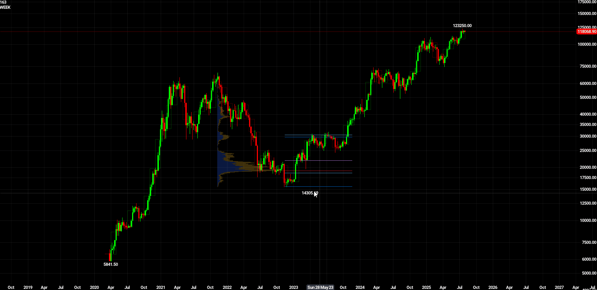

# trading-odin
This codebase serves as a personal testbed to explore a number of different thoughts and ideas around trading. It's very exploratory and directionless.

The program currently downloads Bybit's historical bitcoin trade data (every single trade, over 25GB in total) and stores it all locally.

Some of these ideas are as follows:
- Improving the user experience of a program like TradingView, through improved UI, performance, granularity and workflow.
- Creating novel visualisations of trade data to learn more about the nature of price action.
- Detailed and performant backtesting of strategies, visualised within the chart.
- Creating a customised interface for executing live trades.

The current notable features are:
- Zooming between timeframes 
- Per-trade volume profiles with performance capable of realtime updates at over 60fps, significantly outperforming TradingView in speed and granularity 

The program's functionality is largely centred around the concept of a selection. Selections can be created by holding shift and dragging the mouse. By default, these act as rulers, but additional tools are then accessible from a floating menu (currently only the Volume Profile of note).

Written in Odin! https://odin-lang.org/